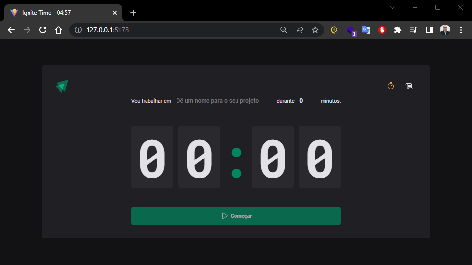
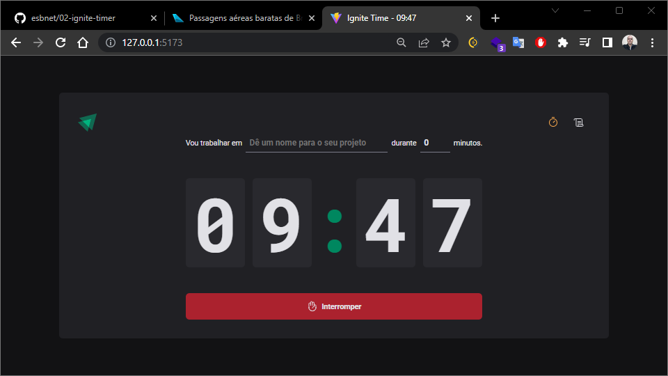
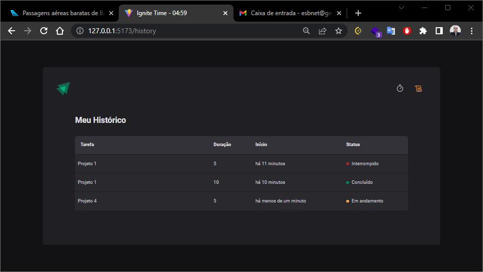

# Timer

Esta aplicação realiza o acompanhamento de realização de tarefas. As tarefas podem ter duração entre 5 e 60 minutos cada.

Inclua a terafa, clique em start e o timer começará a contagem regressiva. Ao término do tempo a tarefa é encerrada e armazenada no histórico com seu status de concluída.

A aplicação contém os recursos básico e pode ser implementada para diversos tipos de aplicação.

## Techs / Resources

- React
- Typescript
- useContext / Immer
- Styled-Components
- Local Storage

## Inclusão da tarefa

Preencha os campos e inicie e acompanhe cronometro regressivo da tarefa.

## Interromper a tarefa

Basta clicar no botão "Interromper" que a tarefa será encerrada e registrada no histórico com seu respectivo status.

## Histórico das tarefas

Clique no ícone superior esquerdo para apresentar a tela de consulta do histórico das tarefas.

---

> [www.rocketseat.com.br](https://www.rocketseat.com.br/)
> Curso - Ignite
